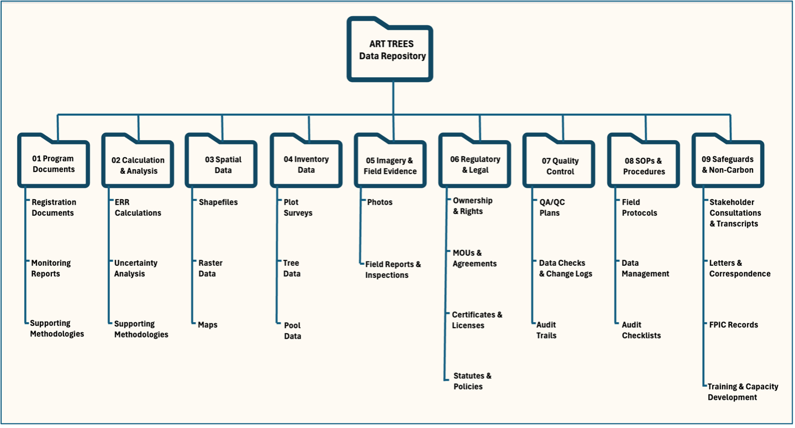

```{r, echo=F, eval=T, message=F, warning=F, error=F, comment=NA}
# install package compiler
install.packages("easypackages")

# let compiler do the work...
easypackages::packages(
  "bslib",
  "caret", "cols4all", "covr", "cowplot",
  "e1071", "exactextractr", "elevatr",
  "gdalcubes", "gdalUtilities", "geojsonsf", "geos", "ggplot2", "ggstats",
  "ggspatial", "ggmap", "ggplotify", "ggpubr", "ggrepel", "giscoR",
  "hdf5r", "httr", "httr2", "htmltools",
  "jsonlite",
  "knitr",
  "leafem", "libgeos", "luz", "lwgeom", "leaflet", "leafgl",
  "mapedit", "mapview", "maptiles", "methods", "mgcv",
  "ncdf4", "nnet",
  "openxlsx",
  "parallel", "plotly",
  "randomForest", "rasterVis", "raster", "Rcpp", "RcppArmadillo",
  "RcppCensSpatial", "rayshader", "RcppEigen", "RcppParallel", "renv",
  "RColorBrewer", "rgl", "RStoolbox", "rts", "rmarkdown",
  "s2", "sf", "scales", "spdep", "stars", "stringr",
  "terra", "testthat", "tidyverse", "tidyterra",
  "tmap", "tmaptools", "terrainr",
  "xgboost", prompt = FALSE)
  
# setup default chunk settings
knitr::opts_chunk$set(
  echo = TRUE, 
  message = FALSE, 
  warning = FALSE,
  error = FALSE, 
  comment = NA, 
  tidy.opts = list(width.cutoff = 6),
  htmltools.dir.version = FALSE, 
  htmltools.preserve.raw = FALSE)
```

----------------------------------------------------------------------------------------------------

{width="500"}

[](https://art.apx.com/mymodule/reg/TabDocuments.asp?r=111&ad=Prpt&act=update&type=PRO&aProj=pub&tablename=doc&id1=109)
[](https://orcid.org/my-orcid?orcid=0000-0002-1792-0351)
[](https://x.com/)
[](https://www.ambiente.gob.ec/)
[](https://nextcloud.ambiente.gob.ec)

----------------------------------------------------------------------------------------------------

Welcome to the
[ART-TREES-demo-repository.git](https://github.com/seamusrobertmurphy/TREES-demo-repository), a
training resource for submitting a complete data package for an ART TREES verification audit. Here,
we document some best practices for using version control to ensure perfect reproducibility of your
calculations.

As you navigate this repository, keep the following **Data Integrity** concepts in mind, as these
are fundamental to how auditors evaluate your submission. For a deeper dive into these principles,
see **Repository Guidelines** section below.

-   **Data Traceability**: Every key figure must be traceable back to its original source data and
    the methodology used to derive it.
-   **Data Completeness**: All information required to justify your GHG assertion must be included,
    with nothing significant missing.
-   **Data Curation**: A logical folder structure, descriptive file names, and clear documentation
    allow auditors to quickly find what they need.
-   **Data Reproducibility**: Implementation of package management and version control using `renv`
    and/or `git` (Appendix III-IV) to ensure auditors achieve identical computational environment
    via dependency indexing and runtime logging.

----------------------------------------------------------------------------------------------------

### Practical Exercise: Mock Audit {#the-practical-exercise-mock-audit}

#### Step 1. Clone the Repository

*Before starting, please ensure Git, R, and RStudio are installed, and an internet connection is
possible (see Appendix IV for installation guides).*

Open your command-line tool (or GitHub Desktop) and clone this repository to your local computer.
This step is crucial for working with precise, version-controlled data.

```{r, eval=F}
git clone https://github.com/seamusrobertmurphy/TREES-demo-repository.git`
```

----------------------------------------------------------------------------------------------------

#### Step 2. Replicate the Script[^1]

[^1]: Please note thatb this public repository is for demonstration purposes. To review Winrock's
    active audit repository used to replicate previous submissions of your program's GHG assertions
    and emissions calculations, you may request access through the following link:
    <https://github.com/seamusrobertmurphy/TREES-ecuador-repository.git>

The analysis script and its data are located in the /02_Carbon_Data/ directory. Simply open the
ART-TREES-TMR-Replication-Demo.Rmd file in your R environment and run it. The script will
automatically perform a simple carbon stock calculation and output the final result.

-   Open the Script: Launch RStudio and open the `02_Carbon_Data/ART-TREES-TMR-Replication-Demo.Rmd`
    file.
-   Inspect the Code: Before running, review the code. You'll see that it's broken down into logical
    chunks:
    -   Loading the required R package (`library(dplyr)`).
    -   Defining the dataset directly within the script (hypothetical forest plot data).
    -   Performing a simple calculation to sum the total carbon stock.
    -   Outputting the final calculated value in tCO₂e.
-   Run the Script: Execute the entire R Markdown file. You can do this by clicking the "Run All
    Chunks" button in RStudio or by using the knitr function. The script will process the data and
    display the final result in the console.

The script’s output will display a single, final calculated value in tCO₂e. Compare this result to
the figure reported in Table 16 of the TMR. They should match exactly.

-   If the results match: You have successfully demonstrated data reproducibility. The combination
    of the version-controlled data and script in this repository has produced the same result as the
    official submission. This is a critical success for any audit.
-   If the results do not match: This is a key learning opportunity. It shows how even small
    discrepancies, a different software version, a missing package, or an altered data file, can
    lead to different results. This is a common and serious finding in a verification audit, and it
    underscores the need for rigorous version control and a robust QA/QC process.

----------------------------------------------------------------------------------------------------

#### Step 3. Document Runtime Log

To demonstrate **data integrity** and **reproducibility**, you must document the exact software
environment used for your calculations. An **auditor will require this runtime log** to
independently verify your results. This step involves generating a log of your R session’s
dependencies and committing it to the repository.

-   Open your R console and run `devtools::session_info()`.

-   Copy the full output and save it as a text file named `runtime_log_YYYYMMDD.txt` in the
    `/06_QAQC/` folder

-   Use Git to commit this file to create a permanent, verifiable link between the code, the data,
    and the computational environment.

The resulting log serves as a snapshot of your computing system and all the software dependencies at
that precise moment in time.

----------------------------------------------------------------------------------------------------

### Appendix I: Repository Guidelines {#appendix-i-repository-guidelines}

We provided a simplified layout in this github repository, as shown in the list of its trunk folders
below. However, this architecture can become highly nested which may not suit everyone's
preferences. Therefore, we welcome any feedback on improved structure that is more appropriate to
your project design, and provide additional layout examples from today's slide for comparison.

----------------------------------------------------------------------------------------------------

-   `01_Program_Data/`

-   `02_Carbon_Data/`

    -   `TREES-demo-replication.Rmd`

-   `03_Spatial_Data/`

-   `04_Uncertainty/`

-   `05_Safeguards/`

-   `06_QAQC_SOPs/`

----------------------------------------------------------------------------------------------------



----------------------------------------------------------------------------------------------------

##### Repository Principles

These are the fundamental concepts that auditors use to evaluate your submission, which are embedded
throughout this repository's structure.

-   Data Traceability: We demonstrate this through clear file naming conventions, a folder for QA/QC
    procedures, and a structure that links report claims to specific evidence files. Every key
    figure in a report, such as X hectares deforested, must be traceable back to its raw data source
    and the methodology used to derive it.
-   Data Completeness: This repository is organized to align directly with the ART TREES
    requirements. This provides a clear framework for you to check if you have all the necessary
    data for every required category, such as deforestation areas, emission factors, and safeguards
    information. The repository also includes a place to document any methodological changes made
    over time.
-   Data Curation: A well-organized data package allows auditors to quickly find what they need. Our
    layout, for example, separates Calculations & Analysis from Spatial Data and SOPs & Procedures.
    This logical grouping helps auditors instinctively navigate your submission. A top-level README
    and descriptive filenames are also key curation practices.
-   Data Reproducibility: Independent verification requires identical computational outcomes. This
    standard demands that any auditor can execute the same analysis and achieve matching results
    using the provided code, data, and environment specifications. Package management tools like
    `renv` (Appendix III) combined with `git` version control (Appendix IV) deliver perfect
    reproducibility through:
    -   Permanent Records: Immutable tracking of all modifications prevents manipulation while
        ensuring verification integrity.
    -   Environment Capture: Precise control of scripts, dependencies, and runtime conditions
        enables exact replication of carbon stock calculations
    -   Change Documentation: Systematic tracking supports robust QA/QC processes required for GHG
        verification audits.

----------------------------------------------------------------------------------------------------

##### Repository Governance

We offer a shortlist of default community health files that may be adapted to include SOPs and
documentation of workbook updates, always aiming to build trust in the auditor:

-   CODE_OF_CONDUCT.md: A CODE_OF_CONDUCT file defines standards for how to engage in a community.
-   CONTRIBUTING.md: A CONTRIBUTING file communicates how people should contribute to your project.
    Discussion category forms can also be added to help customize priority templates issued to
    stakeholder or partners, or community members for opening new discussions in your repository..
-   FUNDING.yml: A FUNDING file displays a sponsor button in your repository to increase the
    visibility of funding options for your open source project.
-   GOVERNANCE.md: A GOVERNANCE file lets people know about how your project is governed. For
    example, it might discuss project roles and how decisions are made.
-   Pull request & config.yml: Issue and pull request templates help standardize the information
    you’d like contributors to include when they open issues and pull requests in your repository.
-   SECURITY.md: A SECURITY file gives instructions on how to report a security vulnerability in
    your project and description that hyperlinks the file. For more information, see [Adding a
    security policy to your
    repository](https://docs.github.com/en/code-security/getting-started/adding-a-security-policy-to-your-repository).
-   SUPPORT.md: A SUPPORT file lets people know about ways to get help with your project. For more
    information, see [Adding support resources to your
    project](https://docs.github.com/en/communities/setting-up-your-project-for-healthy-contributions/adding-support-resources-to-your-project).

----------------------------------------------------------------------------------------------------

### Appendix II: ISO Guidelines {#appendix-ii-iso-guidelines}

The data management principles of traceability, integrity, and reproducibility are key to GHG
audits. These principles are supported by a range of ISO standards. This appendix provides an
overview of those ISO standards relevant to data governance and quality, and provides additional
resources for debugging and validating geospatial operations across platform using the `liblwgeom`
library.

The `liblwgeom` library was derived according to the OpenGIS Simple Features Access (SFA) geometry
rules (ISO 19125) and was purposely built for unbiased unit testing. This `TopGeometry` model drew
on open-source or platform-neutral architecture to allow access to base geometric objects including
Points, Curves, Surfaces, and Geometry Collections `sfc`.

-   The `liblwgeom` library uses the CUnit test framework for unit testing, which provides
    lightweight method to debug spatial operations.
-   The `make` check command runs a set of regression tests for the entire PostGIS system, which
    helps verify the integrity of the installation and its dependencies, such as `PROJ4`in
    cartographic projections and `GEOS` for topological tests.

----------------------------------------------------------------------------------------------------

+--------------+----------------------------------------------------------------------------------+
| ISO Standard | Components relevant to ART-TREES GHG audit verifications                         |
+==============+==================================================================================+
| ISO 27001,   | Two widely discussed ISO standards for data governance are ISO 27001 and ISO     |
|              | 8000. ISO 27001 is a standard for Information Security Management Systems        |
| ISO 8000     | (ISMS), while ISO 8000 focuses on data quality management. Implementing the ISO  |
|              | 27001 standard is a deliverable of information security management under the IT  |
|              | governance program and not solely a data governance deliverable. However, data   |
|              | governance maturity is crucial for complying with ISO 27001 and ensuring data    |
|              | security, confidentiality, and integrity in information management practices.    |
|              | ISO 8000 aims to ensure that data used in various contexts, such as business     |
|              | processes, analytics, and decision-making, meets certain quality standards. It   |
|              | covers all the key elements of data—Syntax, Provenance, Completion, Accuracy,    |
|              | and Certification—providing a standard to measure and certify data quality.      |
+--------------+----------------------------------------------------------------------------------+
| ISO 38505-1  | This is a standard for data governance that provides a set of guidelines for the |
|              | governance of data within an organization. It considers data governance as a     |
|              | subset of IT governance, which in turn is a subset of organizational governance, |
|              | and defines clear responsibilities for the governing body and oversight          |
|              | mechanisms. At its core, it provides a model for evaluating, directing, and      |
|              | monitoring the handling and usage of data in an organization.                    |
+--------------+----------------------------------------------------------------------------------+
| ISO 22745    | This standard focuses on master data exchange between organizations. It          |
|              | specifies data requirements for messages containing master data, including       |
|              | syntax, semantic encoding, and portability. It is often used in conjunction with |
|              | ISO 8000 to realize the benefits of assessing and improving data quality.        |
+--------------+----------------------------------------------------------------------------------+
| ISO 3166     | This standard defines codes for country names, which can be utilized for         |
|              | consistent external reference data in business applications to reduce time and   |
|              | effort in data integration and analytic tasks.                                   |
+--------------+----------------------------------------------------------------------------------+
| ISO 11179    | This metadata registry (MDR) standard provides a framework for representing      |
|              | metadata for an organization to make data understandable and transferable. It    |
|              | provides guidance to software developers building metadata repositories.         |
+--------------+----------------------------------------------------------------------------------+
| ISO 27701    | This standard serves as a data privacy extension to ISO 27001, providing a       |
|              | framework for organizations to establish systems that facilitate compliance with |
|              | data privacy regulations like GDPR.                                              |
+--------------+----------------------------------------------------------------------------------+

----------------------------------------------------------------------------------------------------

### Appendix III: Replication in `renv` {#appendix-iii-replication-in-renv}

`renv` profiles allow for managing different sets of package dependencies for various project
contexts, such as separate environments for development, production, or demonstrations. To activate
a specific `renv` profile, you have two primary options:

##### Step 1. Set a project profile

To make a profile the default for future R sessions, run `renv::activate()` function. Upon
restarting R, you will find `lockfile` path assigned to new project `renv` folder (
`renv/profiles/demo-repo/`).

----------------------------------------------------------------------------------------------------

##### Step 2. Activate a temporary profile:

To activate a profile for the current R session without making it the default, you can set the
`RENV_PROFILE` environment variable.

----------------------------------------------------------------------------------------------------

##### Step 3. Check package dependencies

Use the package dotfiles and environment fields found in
`Config/renv/profiles/<profile_name>/dependencies` and `Config/renv/profiles/<profile_name>/remotes`
to check list of required packages and assign locations of remote repositories for specific package
builds. These environment fields can be also declared in the `DESCRIPTION` file specific to that
`renv` profile.

----------------------------------------------------------------------------------------------------

##### Step 4. Manage package dependencies

-   To capture all packages currently installed in the runtime, while overlooking packages listed in
    existing environment variables, then run `renv::settings$snapshot.type("all")`.
-   Alternatively, you can exclude certain packages from the installation using the
    `renv::settings$ignored.packages("lwgeom")` function. This proves useful with many debugging and
    version control issues among new users.
-   There is also option to manually load and test an `explicit` customized snapshot that overlooks
    default environment fields previously written into the runtime.

```{r, eval=FALSE}
# Activate 'demo-repo' profile and set as default for the project
renv::activate(profile = "demo-repo")

# To activate a 'dev' profile for a single session only
Sys.setenv(RENV_PROFILE = "dev")

# Defining dependencies in DESCRIPTION index
#Config/renv/profiles/shiny/dependencies: shiny, tidyverse
#Config/renv/profiles/shiny/remotes: rstudio/shiny, tidyverse/tidyverse

# Enable 'explicit' snapshot function for the project
renv::settings$snapshot.type("explicit")

# Exclude package from current environment 
renv::settings$ignored.packages("lwgeom")

# deactivate the currently-activated project
renv::deactivate()
```

----------------------------------------------------------------------------------------------------

### Appendix III: Replication in `git`

##### Step 1: Install Git

***Windows***

``` bash
# Option A: Direct download
# Download Git for Windows: https://git-for-windows.github.io/
# During install: select "Git from command line and 3rd-party software"

# Option B: Via Chocolatey package manager
choco install git.install

# Verify installation
git --version
```

***Unix***

``` bash
# Option A: Trigger Xcode command line tools
git --version
# Accept installation prompt

# Option B: Via Homebrew
brew install git

# Option C: Direct download from git-scm.com/downloads

# Verify installation
git --version
```

***Linux***

``` bash
Ubuntu/Debian
sudo apt-get install git

# Fedora/RedHat
sudo dnf install git

# Verify installation
git --version
```

##### Step 2: Setup Command Line Interface

***Windows***

``` bash
# Git Bash (installed with Git for Windows) - Recommended
# Access via: Start Menu → Git Bash

# Alternative: Windows Subsystem for Linux (WSL)
wsl --install
# Restart computer, then install Ubuntu from Microsoft Store

# PowerShell (built-in)
# Access via: Start Menu → PowerShell

# Command Prompt (legacy, not recommended)
# Access via: Start Menu → cmd
```

***Unix***

``` bash
# Terminal (built-in) - Recommended
# Access via: Applications → Utilities → Terminal
# Or: Cmd+Space → type "terminal"

# iTerm2 (enhanced alternative)
# Download from: iterm2.com
brew install --cask iterm2

# Set up better shell (optional)
# Install zsh with oh-my-zsh
sh -c "$(curl -fsSL https://raw.github.com/ohmyzsh/ohmyzsh/master/tools/install.sh)"
```

***Linux***

``` bash
# Most distributions include terminal by default
# Common terminals: gnome-terminal, konsole, xterm

# Ubuntu/Debian: Install additional shells
sudo apt-get install zsh fish

# Set zsh as default shell
chsh -s $(which zsh)

# Install oh-my-zsh for enhanced experience
sh -c "$(curl -fsSL https://raw.github.com/ohmyzsh/ohmyzsh/master/tools/install.sh)"
```

##### Step 3: Setup GitHub Account

-   Register at [github.com](https://github.com)
-   Choose username & verify email
-   Configure Git Identity.

``` bash
# Set your identity (use your real name and GitHub email)
git config --global user.name "Your Full Name"
git config --global user.email "your.email@example.com"

# Set default branch name to 'main'
git config --global init.defaultBranch main

# Set preferred text editor
git config --global core.editor "nano"  # or vim, emacs

# Verify all settings
git config --global --list
```

##### Step 4: Setup Github Authentication

**Option A: HTTPS with Personal Access Token** *(Beginner)*

1.  GitHub =\> Settings =\> Developer settings =\> Personal access tokens =\> Tokens (classic)
2.  Click "Generate new token (classic)"
3.  Set expiration: 90+ days
4.  Select scopes: repo, workflow, gist, user:email
5.  Copy token immediately

``` bash
# Clone test repository
git clone https://github.com/seamusrobertmurphy/TREES-demo-repository
cd TREES-demo-repository

# When prompted for password, use your Personal Access Token (not GitHub password)
# Username: your-github-username
# Password: ghp_xxxxxxxxxxxxxxxxxxxx (your token)

# Optional: Store credentials to avoid repeated prompts
git config --global credential.helper store
```

**Test Authentication:**

``` bash
# Clone test repository
git clone https://github.com/YOUR-USERNAME/test-repo.git
cd test-repo

# When prompted for password, use your Personal Access Token (not GitHub password)
# Username: your-github-username
# Password: ghp_xxxxxxxxxxxxxxxxxxxx (your token)

# Optional: Store credentials to avoid repeated prompts
git config --global credential.helper store
```

**Option B: SSH Keys (Advanced Users)**

**Generate SSH Key:**

``` bash
# Create SSH key pair
ssh-keygen -t ed25519 -C "your.email@example.com"
# Press Enter for default location (~/.ssh/id_ed25519)
# Optional: set passphrase for extra security

# Start ssh-agent and add key
eval "$(ssh-agent -s)"
ssh-add ~/.ssh/id_ed25519
```

**Copy Public Key to GitHub:**

``` bash
# Copy public key to clipboard
# macOS:
pbcopy < ~/.ssh/id_ed25519.pub

# Linux:
xclip -sel clip < ~/.ssh/id_ed25519.pub

# Windows Git Bash:
clip < ~/.ssh/id_ed25519.pub

# Manual copy:
cat ~/.ssh/id_ed25519.pub
# Copy the output manually
```

**Add to GitHub:**

1.  GitHub =\> Settings =\> SSH and GPG keys =\> New SSH key

2.  Paste public key, add descriptive title

3.  Test connection: `ssh -T git@github.com`

##### Step 5: Install R and RStudio

``` bash
# Download and install:
# 1. R from https://www.r-project.org/
# 2. RStudio from https://www.rstudio.com/products/rstudio/download/

# Verify RStudio can find Git:
# Open RStudio → Tools → Global Options → Git/SVN
# Check "Git executable" path is populated
# If not, browse to Git location:
#   Windows: C:/Program Files/Git/bin/git.exe
#   macOS: /usr/bin/git or /usr/local/bin/git
#   Linux: /usr/bin/git
```

##### Step 6: Complete Audit Training Exercise

We offer two types of exercises below that were considered potentially useful for trainee
participants and their audit development.

**Type 1: Clone Repository from GitHub**

``` bash
# Clone the demo repository
git clone https://github.com/seamusrobertmurphy/TREES-demo-repository.git
cd TREES-demo-repository

# Check repository status and history
git status
git log --oneline
git remote -v

# Make a test change
echo "Test line added from CLI" >> README.md

# The 4-step commit process:
# 1. Check what changed
git status

# 2. Stage changes
git add README.md
# Or stage all changes: git add .

# 3. Commit with message
git commit -m "Add test line from command line"

# 4. Push to GitHub
git push origin main

# Verify on GitHub web interface that changes appear
```

**Type 2: Create Local Repository & Push to GitHub**

``` bash
# Create new project directory
mkdir my-new-project
cd my-new-project

# Initialize Git repository
git init

# Create initial files
echo "# My New Project" > README.md
echo "print('Hello World')" > script.py

# Stage and commit initial files
git add .
git commit -m "Initial commit with README and script"

# Create repository on GitHub (via web interface):
# 1. Go to github.com → New repository
# 2. Name it "my-new-project"
# 3. DON'T initialize with README (we already have one)
# 4. Copy the HTTPS URL

# Add remote connection to GitHub
git remote add origin https://github.com/YOUR-USERNAME/my-new-project.git

# Verify remote was added
git remote -v

# Push to GitHub
git push -u origin main
# The -u flag sets upstream tracking for future pushes
```

##### Git Cheatsheets

``` bash
# Repository management
git init                           # Initialize new repository
git clone <url>                    # Download repository from GitHub
git remote -v                      # Show remote connections
git remote add origin <url>        # Connect local repo to GitHub

# Daily workflow commands
git status                         # Check current state
git add <filename>                 # Stage specific file
git add .                          # Stage all changes
git commit -m "description"        # Save changes with message
git push                          # Send to GitHub
git pull                          # Get updates from GitHub

# Viewing history and changes
git log                           # Full commit history
git log --oneline                 # Compact history
git diff                          # Show unstaged changes
git diff --staged                 # Show staged changes

# Branch operations
git branch                        # List branches
git branch feature-name           # Create new branch
git checkout branch-name          # Switch to branch
git checkout -b new-branch        # Create and switch to branch
git merge branch-name             # Merge branch into current

# Useful shortcuts
git commit -am "message"          # Stage and commit in one step
git push -u origin main           # Push and set upstream tracking
git pull --ff-only               # Pull without merge conflicts
```

-   Cheatsheet by `hectorsector` accessed 2025-08 [here](https://training.github.com/)
-   Cheatsheet by Hostinger accessed 2025-08
    [here](https://cdn.hostinger.com/tutorials/pdf/Git-Cheat-Sheet-EN.pdf?_gl=1*pkr9ot*_gcl_au*MTE0MjAzMTE5OC4xNzU0ODAyOTM2*_ga*MTQ1ODYxNTIxNS4xNzU0ODAyOTM2*_ga_73N1QWLEMH*czE3NTQ4MDI5MzYkbzEkZzAkdDE3NTQ4MDI5NTAkajQ2JGwwJGgyOTkyMzE0NDU)

##### Git Troubleshooting

``` bash
# Git not found
which git                         # Check if Git is installed
echo $PATH                        # Verify PATH includes Git

# Authentication failures
git config --global --unset credential.helper  # Clear stored credentials
git push                          # Re-enter credentials

# Permission denied (SSH)
ssh -T git@github.com             # Test SSH connection
ssh-add -l                        # List SSH keys in agent

# Repository not found
git remote -v                     # Check remote URL
git remote set-url origin <correct-url>  # Fix remote URL

# Escape from vim editor (if accidentally opened)
:q                                # Quit without saving
:wq                               # Save and quit

# Merge conflicts
git status                        # See conflicted files
# Edit files to resolve conflicts, then:
git add <resolved-file>
git commit                        # Complete the merge

# Undo last commit (keep changes)
git reset HEAD^                   # Soft reset
git reset --hard HEAD^            # Hard reset (loses changes)
```

##### Git CLI vs Github Website

**When to use GitHub website editing tools:**

-   Creating new repositories
-   Managing repository settings
-   Reviewing pull requests
-   Browsing code and history
-   Managing issues and projects

**When to use command line editing tools:**

-   Daily commit/push/pull workflow
-   Complex Git operations (rebasing, cherry-picking)
-   Scripting and automation
-   Working with multiple repositories
-   Advanced branch management

----------------------------------------------------------------------------------------------------

##### Runtime Log

```{r, eval=F}
devtools::session_info()
```

```         
─ Session info ──────────────────────────────────────────────────────────────────────────────────────────
 setting  value
 version  R version 4.4.3 (2025-02-28)
 os       Fedora Linux 40 (Workstation Edition)
 system   x86_64, linux-gnu
 ui       RStudio
 language (EN)
 collate  en_CA.UTF-8
 ctype    en_CA.UTF-8
 tz       America/Vancouver
 date     2025-08-10
 rstudio  2025.05.0+496 Mariposa Orchid (desktop)
 pandoc   3.1.3 @ /usr/bin/pandoc
 quarto   1.7.31 @ /usr/bin/quarto

─ Packages ──────────────────────────────────────────────────────────────────────────────────────────────
 package     * version date (UTC) lib source
 cachem        1.1.0   2024-05-16 [2] CRAN (R 4.4.0)
 cli           3.6.5   2025-04-23 [2] CRAN (R 4.4.3)
 CoprManager   0.5.7   2025-04-26 [4] local
 devtools      2.4.5   2022-10-11 [2] CRAN (R 4.4.0)
 digest        0.6.37  2024-08-19 [2] CRAN (R 4.4.1)
 ellipsis      0.3.2   2021-04-29 [2] CRAN (R 4.4.0)
 fastmap       1.2.0   2024-05-15 [2] CRAN (R 4.4.0)
 fs            1.6.6   2025-04-12 [2] CRAN (R 4.4.3)
 glue          1.8.0   2024-09-30 [2] CRAN (R 4.4.1)
 htmltools     0.5.8.1 2024-04-04 [2] CRAN (R 4.4.0)
 htmlwidgets   1.6.4   2023-12-06 [2] CRAN (R 4.4.0)
 httpuv        1.6.16  2025-04-16 [2] CRAN (R 4.4.3)
 later         1.4.2   2025-04-08 [2] CRAN (R 4.4.3)
 lifecycle     1.0.4   2023-11-07 [2] CRAN (R 4.4.0)
 magrittr      2.0.3   2022-03-30 [2] CRAN (R 4.4.0)
 memoise       2.0.1   2021-11-26 [2] CRAN (R 4.4.0)
 mime          0.13    2025-03-17 [2] CRAN (R 4.4.3)
 miniUI        0.1.2   2025-04-17 [2] CRAN (R 4.4.3)
 pkgbuild      1.4.7   2025-03-24 [2] CRAN (R 4.4.3)
 pkgload       1.4.0   2024-06-28 [2] CRAN (R 4.4.1)
 profvis       0.4.0   2024-09-20 [2] CRAN (R 4.4.1)
 promises      1.3.2   2024-11-28 [2] CRAN (R 4.4.2)
 purrr         1.0.4   2025-02-05 [2] CRAN (R 4.4.2)
 R6            2.6.1   2025-02-15 [2] CRAN (R 4.4.2)
 Rcpp          1.0.14  2025-01-12 [2] CRAN (R 4.4.2)
 remotes       2.5.0   2024-03-17 [2] CRAN (R 4.4.0)
 rlang         1.1.6   2025-04-11 [2] CRAN (R 4.4.3)
 rstudioapi    0.17.1  2024-10-22 [2] CRAN (R 4.4.1)
 sessioninfo   1.2.3   2025-02-05 [2] CRAN (R 4.4.2)
 shiny         1.10.0  2024-12-14 [2] CRAN (R 4.4.2)
 urlchecker    1.0.1   2021-11-30 [2] CRAN (R 4.4.0)
 usethis       3.1.0   2024-11-26 [2] CRAN (R 4.4.2)
 vctrs         0.6.5   2023-12-01 [2] CRAN (R 4.4.0)
 xtable        1.8-4   2019-04-21 [2] CRAN (R 4.4.0)

 [1] /home/seamus/R/x86_64-redhat-linux-gnu-library/4.4
 [2] /usr/local/lib/R/library
 [3] /usr/lib64/R/library
 [4] /usr/share/R/library
```

``` r
#Sys.getenv()
```
