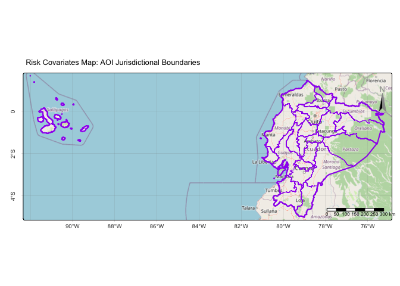

ART-TREES Audit Replication Demo C
================
Winrock Intl
2025-08-11

- [Introduction](#introduction)
- [Import data](#import-data)
  - [AOI Jurisdiction](#aoi-jurisdiction)
  - [Built Environment](#built-environment)
  - [Transportation](#transportation)
  - [Hydrography](#hydrography)
  - [Transport](#transport)
  - [Topography](#topography)

    ##           GEOS           GDAL         proj.4 GDAL_with_GEOS     USE_PROJ_H 
    ##       "3.13.1"       "3.11.3"        "9.6.2"         "true"         "true" 
    ##           PROJ 
    ##        "9.6.2"

------------------------------------------------------------------------

### Introduction

The following spatial covariates were imported as potential drivers of
deforestation risk. Covariates were merged between demographic and
geographic datasets surrounding the project area and national level
datasets beyond the project area in order to enable jurisdictional
analysis.

### Import data

#### AOI Jurisdiction

``` r
library(geodata)
library(tmaptools)
library(tmap)
library(sf)
sf::sf_extSoftVersion()
```

              GEOS           GDAL         proj.4 GDAL_with_GEOS     USE_PROJ_H 
          "3.13.1"       "3.11.3"        "9.6.2"         "true"         "true" 
              PROJ 
           "9.6.2" 

``` r
# AOI Jurisdictional Bdry 
aoi_country = geodata::gadm(country="ECU", level=0, path="./03_Spatial_Data/AOI") |> sf::st_as_sf()
aoi_states  = geodata::gadm(country="ECU", level=1, path="./03_Spatial_Data/AOI") |> sf::st_as_sf()
st_write(aoi_country, "./03_Spatial_Data/AOI/aoi_country.shp", delete_dsn = T)
```

    Deleting source `./03_Spatial_Data/AOI/aoi_country.shp' using driver `ESRI Shapefile'
    Writing layer `aoi_country' to data source 
      `./03_Spatial_Data/AOI/aoi_country.shp' using driver `ESRI Shapefile'
    Writing 1 features with 2 fields and geometry type Multi Polygon.

``` r
st_write(aoi_states, "./03_Spatial_Data/AOI/aoi_states.shp", delete_dsn = T)
```

    Deleting source `./03_Spatial_Data/AOI/aoi_states.shp' using driver `ESRI Shapefile'
    Writing layer `aoi_states' to data source 
      `./03_Spatial_Data/AOI/aoi_states.shp' using driver `ESRI Shapefile'
    Writing 24 features with 11 fields and geometry type Unknown (any).

``` r
crs_master = sf::st_crs(aoi_country)

# Visualize
tmap::tmap_mode("plot")
tmap::tm_shape(aoi_country) + tmap::tm_borders(col="orange", lwd=3) +
  tmap::tm_shape(aoi_states) + tmap::tm_borders(col="green") +
  tmap::tm_scalebar(position=c("RIGHT", "BOTTOM"), text.size = .5) +
  tmap::tm_compass(color.dark="gray60",text.color="gray60",position=c("RIGHT", "top")) +
  tmap::tm_graticules(lines=T,labels.rot=c(0,90),lwd=0.2) +
  tmap::tm_layout(legend.position=c("left", "top"), legend.bg.color = "white") +
  tmap::tm_title("Risk Covariates Map: AOI Jurisdictional Boundaries", size=.8) + 
  tmap::tm_basemap("OpenStreetMap") 
```

<!-- -->

``` r
  #tmap::tm_basemap("OpenTopoMap") 
  #tmap::tm_basemap("Esri.WorldImagery") 
```

#### Built Environment

``` r
library(osmdata)
library(httr2)
library(ggmap)

# Check OSM data & derive bbox window
osmdata::available_features()  
aoi_bbox = osmdata::getbb("Ecuador")

# Hospitals
buildings_hospital = aoi_bbox |> osmdata::opq() |>
  osmdata::add_osm_feature(key = "amenity", value = "hospital") |>
  osmdata::osmdata_sf() # |> st_transform(crs_master)

# Housing
buildings_residential = aoi_bbox |> osmdata::opq() |>
  osmdata::add_osm_feature(key = "shelter", value = "building") |>
  osmdata::osmdata_sf() # |> st_transform(crs_master)

# Religion
buildings_workship = aoi_bbox |> osmdata::opq() |>
  osmdata::add_osm_feature(key = "shelter", value = "building") |>
  osmdata::osmdata_sf() |> st_cast("POINT") # |>
  #sf::st_transform(crs_master) |>
  #sf::st_intersection(aoi_country)|>
  #dplyr::select(name,fclass)|>
  #dplyr::rename(creed=fclass) |> 
  #dplyr::mutate(creed=as.factor(creed))  |> 

buildings_merged = buildings_hospital |>
  bind_rows(buildings_residential, buildings_workship) |>
  group_by(across(-geometry)) |> sf::st_cast("POINT")
  summarise(geometry = st_union(geometry), .groups = "drop")
sf::st_write(buildings_merged, "./03_Spatial_Data/Risk/buildings_merged.shp", delete_dsn=T) 
#🎗️Reminder: Incorporate CCDF formatting& repo layout guides
#🎗https://rmi.org/carbon-crediting-data-framework/

# Visualize & check
tmap::tm_shape(aoi_country) + tmap::tm_borders(col="green", lwd=3) +
  tmap::tm_shape(aoi_states) + tmap::tm_borders(col="orange") +
  tmap::tm_shape(buildings_merged) + tmap::tm_symbols(size=0.35,lwd=0.5,fill="purple",col="white") +
  tmap::tm_add_legend(type="symbols", col="purple", fill="purple", size=0.8, labels = "Buildings (OSM)") +
  tmap::tm_scalebar(position=c("RIGHT", "BOTTOM"), text.size = .5) +
  tmap::tm_compass(color.dark="gray60",text.color="gray60",position=c("RIGHT", "top")) +
  tmap::tm_graticules(lines=T,labels.rot=c(0,90),lwd=0.2) +
  tmap::tm_layout(legend.position=c("left", "top"), legend.bg.color = "white") +
  tmap::tm_title("Risk Covariates Map: Built Environment", size=.8) + 
  tmap::tm_basemap("OpenStreetMap") 
  #tmap::tm_basemap("OpenTopoMap") 
  #tmap::tm_basemap("Esri.WorldImagery") 
```

#### Transportation

``` r
# Motorway/Highways
transport_motorway <- aoi_bbox %>% opq() %>%
  add_osm_feature(key = "highway", value = "motorway") %>%
  osmdata_sf()

# Roads
transport_road <- aoi_bbox %>% opq() %>%
  add_osm_feature(key = "XXXXXXX", value = "XXXXXXX") %>%
  osmdata_sf()

# Paths
transport_path <- aoi_bbox %>% opq() %>%
  add_osm_feature(key = "XXXXXXX", value = "XXXXXXX") %>%
  osmdata_sf()

# Railways
transport_path <- aoi_bbox %>% opq() %>%
  add_osm_feature(key = "XXXXXXX", value = "XXXXXXX") %>%
  osmdata_sf()

# Visualize
tmap::tm_shape(aoi_country) + tmap::tm_borders(col="green", lwd=3) +
  tmap::tm_shape(aoi_states) + tmap::tm_borders(col="orange") +
  tmap::tm_scalebar(position=c("RIGHT", "BOTTOM"), text.size = .5) +
  tmap::tm_compass(color.dark="gray60",text.color="gray60",position=c("RIGHT", "top")) +
  tmap::tm_graticules(lines=T,labels.rot=c(0,90),lwd=0.2) +
  tmap::tm_layout(legend.position=c("left", "top"), legend.bg.color = "white") +
  tmap::tm_title("Spatial Covariates Map: Transport Infrastructure", size=.8) + 
  tmap::tm_basemap("OpenStreetMap") 
  #tmap::tm_basemap("OpenTopoMap") 
  #tmap::tm_basemap("Esri.WorldImagery") 
```

``` r
# Housing
places_points_liberia_1=sf::st_read("./data/liberia-osmdata/liberia_point.shp")|>
  st_cast("POINT")|>sf::st_intersection(country)|>
  dplyr::select(name,place)|>
  dplyr::mutate(place = as.factor(place)) |> 
  dplyr::mutate(name = as.character(name))

places_points_liberia_2 <- sf::st_read("./data/liberia-osmdata/gis_osm_places_free_1.shp")|>
  st_cast("POINT")|>sf::st_intersection(country)|>
  dplyr::select(name,fclass)|>
  dplyr::rename(place=fclass)|>
  dplyr::mutate(place = as.factor(place))|> 
  dplyr::mutate(name = as.character(name))

places_worship <- sf::st_read("./data/liberia-osmdata/gis_osm_pofw_free_1.shp") |>
  sf::st_intersection(country)|>
  dplyr::select(name,fclass)|>
  dplyr::rename(creed=fclass) |> 
  dplyr::mutate(creed=as.factor(creed))  |> 
  dplyr::mutate(name = as.character(name)) |> 
  st_cast("POINT")

places_points <- places_points_project %>%
  bind_rows(places_points_liberia_1,places_points_liberia_2, places_worship) %>%
  group_by(across(-geometry)) %>%
  summarise(geometry = st_union(geometry), .groups = "drop")
places_points = sf::st_cast(places_points, "POINT")
sf::st_write(places_points, "./data/covariates/places_points.shp", delete_dsn=T)

buildings_private <- sf::st_read("./data/liberia-osmdata/gis_osm_buildings_a_free_1.shp") |> 
  sf::st_intersection(country) |> sf::st_simplify(preserveTopology = FALSE, dTolerance = 1000) |>
  dplyr::select(name,fclass) |>
  dplyr::rename(place = fclass) |> 
  dplyr::mutate(place = as.factor(place))|> 
  dplyr::mutate(name = as.character(name)) |>
  st_cast("MULTIPOLYGON") 
sf::st_write(buildings_private, "./data/covariates/buildings_private.shp", delete_dsn=T)

buildings_public <- sf::st_read("./data/liberia-osmdata/gis_osm_pois_a_free_1.shp")  |>
  sf::st_intersection(country) |>
  dplyr::select(name,fclass) |>
  dplyr::rename(place = fclass) |> 
  dplyr::mutate(place = as.factor(place))|> 
  dplyr::mutate(name = as.character(name)) |>
  st_cast("MULTIPOLYGON") 
sf::st_write(buildings_public, "./data/covariates/buildings_public.shp", delete_dsn=T)

# Boundaries
places_poly_liberia <- sf::st_read("./data/liberia-osmdata/liberia_poly.shp")|>st_cast("GEOMETRY")
places_poly_county <- places_poly_liberia[st_geometry_type(places_poly_liberia) %in% c("POLYGON", "MULTIPOLYGON"), ] |>
  sf::st_intersection(country)|>
  dplyr::select(name,place,admin_leve)|>
  dplyr::mutate(place = as.factor(place)) |> 
  dplyr::mutate(name = as.character(name)) |>
  dplyr::rename(admin_level = admin_leve) |>
  dplyr::filter(admin_level == "4") 
places_poly_county <- places_poly_county[st_geometry_type(places_poly_county) %in% c("POLYGON", "MULTIPOLYGON"), ] |>
  sf::st_cast("MULTIPOLYGON")
sf::st_write(places_poly_county, "./data/covariates/places_poly_county.shp", delete_dsn=T)  

places_poly_district <- places_poly_liberia[st_geometry_type(places_poly_liberia) %in% c("POLYGON", "MULTIPOLYGON"), ] |>
  st_cast("POLYGON")|>sf::st_intersection(country)|>
  dplyr::select(name,place,admin_leve)|>
  dplyr::mutate(place = as.factor(place)) |> 
  dplyr::mutate(name = as.character(name)) |>
  dplyr::rename(admin_level = admin_leve) |>
  dplyr::filter(admin_level == "6")
places_poly_district <- places_poly_district[st_geometry_type(places_poly_district) %in% c("POLYGON", "MULTIPOLYGON"), ] |>
  sf::st_cast("MULTIPOLYGON")
sf::st_write(places_poly_district, "./data/covariates/places_poly_district.shp", delete_dsn=T)  
```

#### Hydrography

``` r
waterways_liberia =
sf::st_read("./data/liberia-osmdata/gis_osm_waterways_free_1.shp")
\|\> sf::st_intersection(bbox_country) \|\> dplyr::select(name,fclass)
\|\> dplyr::mutate(fclass = as.factor(fclass))\|\> dplyr::mutate(name
= as.character(name)) waterways_liberia \<-
waterways_liberia[st_geometry_type(waterways_liberia) %in%
c("LINESTRING", "MULTILINESTRING"), ] \|\> st_cast("MULTILINESTRING")

waterways_project = sf::st_read("./data/Winrock_GIS/PA_river.shp")
\|\> sf::st_intersection(bbox_country) \|\> dplyr::select(name,fclass)
\|\> dplyr::mutate(fclass = as.factor(fclass))\|\> dplyr::mutate(name
= as.character(name)) waterways_project \<-
waterways_project[st_geometry_type(waterways_project) %in%
c("LINESTRING", "MULTILINESTRING"), ] \|\> st_cast("MULTILINESTRING")

waterways_hydrosheds =
sf::st_read("/Users/seamus/repos/rspb-redd-risk-new/data/hydro/HydroRIVERS_v10_af.shp")
\|\> sf::st_intersection(bbox_country) waterways_hydrosheds \<-
waterways_hydrosheds[st_geometry_type(waterways_hydrosheds) %in%
c("LINESTRING", "MULTILINESTRING"), ] \|\> st_cast("MULTILINESTRING")

waterways_merged \<- waterways_liberia \|\>
bind_rows(waterways_project) \|\> group_by(across(-geometry)) \|\>
summarise(geometry = st_union(geometry), .groups = "drop")
waterways_merged = sf::st_cast(waterways_merged, "MULTILINESTRING")
sf::st_write(waterways_merged,
"./data/covariates/waterways_merged.shp", delete_dsn=T)

waterbodies_collection =
sf::st_read("./data/liberia-osmdata/gis_osm_water_a_free_1.shp") \|\>
sf::st_intersection(bbox_country) \|\> dplyr::select(name,fclass) \|\>
dplyr::mutate(fclass = as.factor(fclass))\|\> dplyr::mutate(name =
as.character(name)) waterbodies_poly \<-
waterbodies_collection[st_geometry_type(waterbodies_collection) %in%
c("POLYGON", "MULTIPOLYGON"), ] waterbodies_lines \<-
waterbodies_collection[st_geometry_type(waterbodies_collection) %in%
c("LINESTRING", "MULTILINESTRING"), ] waterbodies_poly_lines =
sf::st_boundary(waterbodies_poly)

waterbodies_waterways_merged \<- waterbodies_lines \|\>
bind_rows(waterbodies_poly_lines, waterways_merged) \|\>
group_by(across(-geometry)) \|\> summarise(geometry =
st_union(geometry), .groups = "drop") waterbodies_waterways_merged =
sf::st_cast(waterbodies_waterways_merged, "MULTILINESTRING")
sf::st_write(waterbodies_waterways_merged,
"./data/covariates/waterbodies_waterways_merged.shp", delete_dsn=T)
```

#### Transport

``` r
transport=sf::st_read("./data/liberia-osmdata/gis_osm_transport_a_free_1.shp")\|\>
st_boundary()\|\> sf::st_intersection(bbox_country_2) \|\>
dplyr::select(name,fclass) \|\> dplyr::mutate(fclass =
as.factor(fclass))\|\> dplyr::mutate(name = as.character(name))

railways =
sf::st_read("./data/liberia-osmdata/gis_osm_railways_free_1.shp") \|\>
sf::st_intersection(bbox_country_2) \|\> dplyr::select(name,fclass)
\|\> dplyr::mutate(fclass = as.factor(fclass))\|\> dplyr::mutate(name
= as.character(name))

roads_liberia =
sf::st_read("./data/liberia-osmdata/gis_osm_roads_free_1.shp") \|\>
sf::st_intersection(bbox_country_2) \|\> dplyr::select(name,fclass)
\|\> dplyr::mutate(fclass = as.factor(fclass))\|\> dplyr::mutate(name
= as.character(name))

roads_project = sf::st_read("./data/Winrock_GIS/PA_roads.shp") \|\>
sf::st_intersection(bbox_country_1) \|\> dplyr::select(name,fclass)
\|\> dplyr::mutate(fclass = as.factor(fclass))\|\> dplyr::mutate(name
= as.character(name))

roads_rail_transport_merged \<- transport \|\> bind_rows(railways,
roads_liberia, roads_project) \|\> group_by(across(-geometry)) \|\>
summarise(geometry = st_union(geometry), .groups = "drop")

roads = sf::st_cast(roads_rail_transport_merged, "MULTILINESTRING")
sf::st_write(roads,
"./data/covariates/roads_rail_transport_merged.shp", delete_dsn=T)

roads \<- roads \|\> bind_rows(roads_sle) \|\>
group_by(across(-geometry)) \|\> summarise(geometry =
st_union(geometry), .groups = "drop") sf::st_write(roads,
"./data/covariates/roads_intl.shp", delete_dsn=T)

roads_lib = sf::st_read("./data/covariates/roads_intl.shp") \|\>
st_cast("MULTILINESTRING") roads_sle =
sf::st_read("./data/liberia-osmdata/hotosm_sle_roads_lines_shp.shp")
\|\>st_cast("MULTILINESTRING") roads_lib =
sf::st_intersection(roads_lib, bbox_aoi_2)\|\>dplyr::select(name)
roads_sle = sf::st_intersection(roads_sle,
bbox_aoi_2)\|\>dplyr::select(name) roads = rbind(roads_lib, roads_sle)
sf::st_write(roads, "./data/ROADS/roads.shp", delete_layer=T)

roads_lib = sf::st_intersection(roads_lib, bbox_aoi_2) roads_sle =
sf::st_intersection(roads_sle, bbox_aoi_2)
tmap::tm_shape(roads_clip) + tmap::tm_lines(col="orange", lwd=0.6) +
tmap::tm_shape(aoi) + tm_borders(col="red", lwd=1.7)
```

#### Topography

``` r
dem = raster::subset(STACK, "DEM") 
slope_tangent = raster::terrain(dem,
  opt="slope",
  unit="tangent",
  neighbors=8,
  filename="./data/DEM/slope_tangent.tif"
  )

slope_tangent = terra::rast("./data/DEM/slope_tangent.tif")
slope_percent = slope_tangent * 100 
slope_percent = terra::clamp(slope_percent, 0, 100) 
slope_percent = raster::raster(slope_percent) 
raster::writeRaster(slope_percent,"./data/covariates/slope_percent.tif", overwrite=T)

urban <- terra::mask(LULC_LIBERIA_2024, LULC_LIBERIA_2024 == 4, maskvalue = FALSE) 
urban <- raster::raster(urban)
raster::writeRaster(urban, "./data/covariates/urban.tif", overwrite=T)
```
