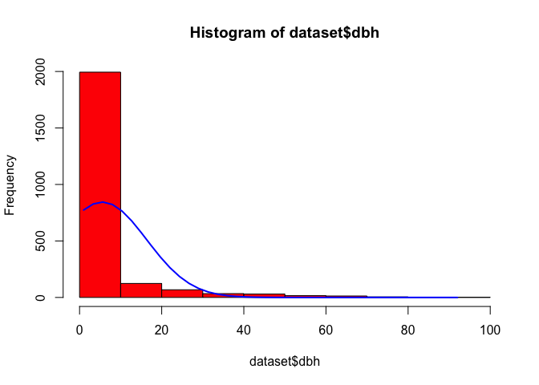

[](https://art.apx.com/mymodule/reg/TabDocuments.asp?r=111&ad=Prpt&act=update&type=PRO&aProj=pub&tablename=doc&id1=109)
[](https://orcid.org/my-orcid?orcid=0000-0002-1792-0351)
[](https://x.com/)
[](https://www.ambiente.gob.ec/)
[](https://nextcloud.ambiente.gob.ec)

----------------------------------------------------------------------------------------------------

Winrock Intl 2025-08

-   [Introduction](#introduction)
-   [Import data](#import-data)
-   [Activity data simulation](#activity-data-simulation)
    -   [Train classifier](#train-classifier)
    -   [Classify landcover](#classify-landcover)
    -   [Visualize uncertainty](#visualize-uncertainty)
-   [Record Runtime log](#record-runtime-log)

----------------------------------------------------------------------------------------------------

### **Introduction** {#introduction}

As cited on page 46 of the TREES Standards (V2.0), calculations of uncertainty deductions are
derived using the following formula:

$$
UNC_t = (GHG ER_t + GHG REMV_t) \times UA_t \text{.            EQ 10}
$$

##### Table 1: Parameters used in Equation 10

|              |                                                                   |
|--------------|-------------------------------------------------------------------|
| $UNC_t$      | Uncertainty deduction for year $t$ ($tCO_2e$)                     |
| $GHG ER_t$   | Gross greenhouse gas emissions reductions for year $t$ ($tCO_2e$) |
| $GHG REMV_t$ | Gross greenhouse gas removals for year $t$ ($tCO_2e$)             |
| $UA_t$       | The uncertainty adjustment factor for year $t$                    |

The uncertainty adjustment factor ($UAdj_t$) quantifies the proportional adjustment to emissions
reductions and removals based on statistical uncertainty. It is defined as:

$$
UAdj_t = 0.524417 \times \frac{HW_{90\%t}}{1.645006}}
$$

##### Table 2: Parameters used in Equation 11

|                       |                                                                 |
|-----------------------|-----------------------------------------------------------------|
| $90\%\text{ C I}_{t}$ | The half-width of 90% confidence interval as percentage of mean |
| $1.645006$            | $t$ value for a 90% confidence interval                         |
| $0.524417$            | A scaling constant to adjust the proportion.                    |

----------------------------------------------------------------------------------------------------

### Import data {#import-data}

This section outlines the tools for importing and preparing forestry and biomass data for analysis,
a key step in building ART-TREES-compliant MRV systems. Using the `allodb` package, we load a global
allometry database and a dummy dataset from the Smithsonian Institute `ForestGEO` project.

``` r
devtools::install_github("ropensci/allodb") # https://docs.ropensci.org/allodb/
library("allodb")
set.seed(333)
data(scbi_stem1)
dataset = scbi_stem1
head(dataset) |> tibble::as_tibble()
```

```         
# A tibble: 6 × 6
  treeID stemID   dbh genus species Family     
   <int>  <int> <dbl> <chr> <chr>   <chr>      
1   2695   2695  1.41 Acer  negundo Sapindaceae
2   1229  38557  1.67 Acer  negundo Sapindaceae
3   1230   1230  1.42 Acer  negundo Sapindaceae
4   1295  32303  1.04 Acer  negundo Sapindaceae
5   1229  32273  2.47 Acer  negundo Sapindaceae
6     66  31258  2.19 Acer  negundo Sapindaceae
```

``` r
psych::describe(dataset)
```

```         
         vars    n     mean       sd  median  trimmed     mad min      max
treeID      1 2287  2778.66  1929.26 2525.00  2705.54 2091.95   1  6207.00
stemID      2 2287 16577.12 16197.88 5022.00 15661.27 5749.52   1 40180.00
dbh         3 2287     5.52    10.80    1.67     2.65    0.79   1    92.02
genus*      4 2287    16.37     6.52   18.00    16.71    0.00   1    31.00
species*    5 2287    13.26     9.60    8.00    11.31    0.00   1    40.00
Family*     6 2287    13.07     4.02   13.00    13.33    0.00   1    22.00
            range  skew kurtosis     se
treeID    6206.00  0.27    -1.11  40.34
stemID   40179.00  0.40    -1.75 338.71
dbh         91.02  3.81    16.30   0.23
genus*      30.00 -0.57     0.14   0.14
species*    39.00  1.59     1.30   0.20
Family*     21.00 -0.58     1.44   0.08
```

``` r
str(dataset)
```

```         
tibble [2,287 × 6] (S3: tbl_df/tbl/data.frame)
 $ treeID : int [1:2287] 2695 1229 1230 1295 1229 66 2600 4936 1229 1005 ...
 $ stemID : int [1:2287] 2695 38557 1230 32303 32273 31258 2600 4936 36996 1005 ...
 $ dbh    : num [1:2287] 1.41 1.67 1.42 1.04 2.47 ...
 $ genus  : chr [1:2287] "Acer" "Acer" "Acer" "Acer" ...
 $ species: chr [1:2287] "negundo" "negundo" "negundo" "negundo" ...
 $ Family : chr [1:2287] "Sapindaceae" "Sapindaceae" "Sapindaceae" "Sapindaceae" ...
```

##### Table 3: Table summary of public dataset from `allodb` package (n = 2287)

Accurate selection of probability density functions (PDFs) is essential for modeling uncertainties
in carbon stocks and activity data. This section describes methodologies for fitting PDFs to data,
ensuring results are robust and aligned with ART-TREES best practices.

-   Use of statistical tests for goodness-of-fit validation.
-   Integration of domain expertise to refine parameter selection.

``` r
# add allometry database
data(equations)
data("equations_metadata")
show_cols   = c("equation_id", "equation_taxa", "equation_allometry")
eq_tab_acer = new_equations(subset_taxa = "Acer")
head(eq_tab_acer[, show_cols])
```

```         
# A tibble: 6 × 3
  equation_id equation_taxa       equation_allometry                            
  <chr>       <chr>               <chr>                                         
1 a4e4d1      Acer saccharum      exp(-2.192-0.011*dbh+2.67*(log(dbh)))         
2 dfc2c7      Acer rubrum         2.02338*(dbh^2)^1.27612                       
3 eac63e      Acer rubrum         5.2879*(dbh^2)^1.07581                        
4 f49bcb      Acer pseudoplatanus exp(-5.644074+(2.5189*(log(pi*dbh))))         
5 14bf3d      Acer mandshuricum   0.0335*(dbh)^1.606+0.0026*(dbh)^3.323+0.1222*…
6 0c7cd6      Acer mono           0.0202*(dbh)^1.810+0.0111*(dbh)^2.740+0.1156*…
```

``` r
# Compute above ground biomass
dataset$agb = allodb::get_biomass(
    dbh     = dataset$dbh,
    genus   = dataset$genus,
    species = dataset$species,
    coords  = c(-78.2, 38.9)
  )

# examine dbh ~ agb function
dbh_agb = lm(dbh ~ agb, data = dataset)
#olsrr::ols_test_breusch_pagan(lm(dbh_agb)) #<0.0000
#h = lattice::histogram(dbh ~ agb, data = dataset)
plot(
  x    = dataset$dbh,
  y    = dataset$agb,
  col  = factor(scbi_stem1$genus),
  xlab = "DBH (cm)",
  ylab = "AGB (kg)"
)

# examine univariate distributions
h1 = hist(dataset$dbh, breaks=10, col="red")
xfit<-seq(min(dataset$dbh),max(dataset$dbh),length=40)
yfit<-dnorm(xfit,mean=mean(dataset$dbh),sd=sd(dataset$dbh))
yfit <- yfit*diff(h1$mids[1:2])*length(dataset$dbh)
lines(xfit, yfit, col="blue", lwd=2)

h2 = hist(dataset$agb, breaks=10, col="red")
xfit<-seq(min(dataset$agb),max(dataset$agb),length=40)
yfit<-dnorm(xfit,mean=mean(dataset$agb),sd=sd(dataset$agb))
yfit <- yfit*diff(h2$mids[1:2])*length(dataset$agb)
lines(xfit, yfit, col="blue", lwd=2)
wilcox.test(dataset$dbh) # p<0.00001
```

```         
    Wilcoxon signed rank test with continuity correction

data:  dataset$dbh
V = 2616328, p-value < 2.2e-16
alternative hypothesis: true location is not equal to 0
```

``` r
wilcox.test(dataset$agb) # p<0.00001
```

```         
    Wilcoxon signed rank test with continuity correction

data:  dataset$agb
V = 2616328, p-value < 2.2e-16
alternative hypothesis: true location is not equal to 0
```



### Activity data simulation {#activity-data-simulation}

This section introduces the design of the Monte Carlo simulation regime, including:

-   Simulation parameters are defined to balance computational efficiency and statistical
    robustness.
-   Cross-validation techniques are employed to evaluate model performance and identify bias or
    variance.

The `LGOCV` acronym used in the `caret` package functions below stands for “leave one group out
cross validation”. We must select the `%` of test data that is set out from the build upon which the
model will be repeatedly trained. Note, the following code applies functions to full dataset without
explicit training-test split.

``` r
# Cross-validation split for bias detection
#samples     = caret::createDataPartition(dataset_tidy$volume, p = 0.80, list = FALSE)
#train_data  = dataset_tidy[samples, ]
#test_data   = dataset_tidy[-samples, ]

# Simulation pattern & regime
monte_carlo = trainControl(
  method    = "LGOCV",
  number    = 10,     # number of simulations
  p         = 0.8)     # percentage resampled


# Training model fit with all covariates (".") & the simulation
lm_monte_carlo = train(
  data      = dataset, 
  agb ~ ., 
  na.action = na.omit,
  trControl = monte_carlo)

lm_monte_carlo 
```

```         
Random Forest 

2287 samples
   6 predictor

No pre-processing
Resampling: Repeated Train/Test Splits Estimated (10 reps, 80%) 
Summary of sample sizes: 1832, 1832, 1832, 1832, 1832, 1832, ... 
Resampling results across tuning parameters:

  mtry  RMSE       Rsquared   MAE       
   2    334.19769  0.6035154  114.313008
  47     82.31374  0.9715600   13.758606
  93     49.07356  0.9898362    8.510285

RMSE was used to select the optimal model using the smallest value.
The final value used for the model was mtry = 93.
```

To enable access to these predictions, we need to instruct `caret` to retain the resampled
predictions by setting `savePredictions = "final"` in our `trainControl()` function. It’s important
to be aware that if you’re working with a large dataset or numerous resampling iterations, the
resulting `train()` object may grow significantly in size. This happens because `caret` must store a
record of every row, including both the observed values and predictions, for each resampling
iteration. By visualizing the results, we can offer insights into the performance of our model on
the resampled data.

``` r
monte_carlo_viz = trainControl(
  method    = "LGOCV", 
  p         = 0.8,            
  number    = 1,  # just for saving previous results
  savePredictions = "final") 

lm_monte_carlo_viz = train(
  agb ~ ., 
  data      = dataset, 
  method    = "lm",
  na.action = na.omit,
  trControl = monte_carlo_viz)

head(lm_monte_carlo_viz$pred)  # residuals 
```

```         
  intercept       pred          obs rowIndex  Resample
1      TRUE -109.35929   0.18320423        1 Resample1
2      TRUE  -63.59706   0.56378062        6 Resample1
3      TRUE -130.47898   0.18320423       10 Resample1
4      TRUE -144.19036   0.09947204       12 Resample1
5      TRUE -142.33348   0.09496032       15 Resample1
6      TRUE 1222.08038 789.41947426       18 Resample1
```

``` r
lm_monte_carlo_viz$pred |> 
  ggplot(aes(x=pred,y=obs)) +
    geom_point(shape=1) + 
    geom_abline(slope=1, colour='blue')  +
    coord_obs_pred()
```

<!-- -->

This following chunks showcase running a Monte Carlo simulations of LULC classification to estimate
uncertainty of activity data predictons.

``` r
remotes::install_github("ytarazona/ForesToolboxRS")
library(ForesToolboxRS)
dir.create("./data/testdata")
download.file("https://github.com/ytarazona/ft_data/raw/main/data/LC08_232066_20190727_SR.zip", destfile = "testdata/LC08_232066_20190727_SR.zip")
unzip("testdata/LC08_232066_20190727_SR.zip", exdir = "testdata") 
download.file("https://github.com/ytarazona/ft_data/raw/main/data/signatures.zip", destfile = "testdata/signatures.zip")
unzip("testdata/signatures.zip", exdir = "testdata")

image <- stack("./data/testdata/LC08_232066_20190727_SR.tif")
sig <- read_sf("./data/testdata/signatures.shp")
```

#### Train classifier {#train-classifier}

``` r
classRF <- mla(img = image, model = "randomForest", endm = sig, training_split = 80)
print(classRF)
```

#### Classify landcover {#classify-landcover}

``` r
# Classification
colmap <- c("#0000FF","#228B22","#FF1493", "#00FF00")
plot(classRF$Classification, main = "RandomForest Classification", col = colmap, axes = TRUE)
```

#### Visualize uncertainty {#visualize-uncertainty}

``` r
plot(
  cal_ml$svm_mccv,
  main = "Monte Carlo Cross-Validation calibration",
  col = "darkmagenta",
  type = "b",
  ylim = c(0, 0.4),
  ylab = "Error between 0 and 1",
  xlab = "Number of iterations"
)
lines(cal_ml$randomForest_mccv, col = "red", type = "b")
lines(cal_ml$naiveBayes_mccv, col = "green", type = "b")
lines(cal_ml$knn_mccv, col = "blue", type = "b")
legend(
  "topleft",
  c(
    "Support Vector Machine",
    "Random Forest",
    "Naive Bayes",
    "K-nearest Neighbors"
  ),
  col = c("darkmagenta", "red", "green", "blue"),
  lty = 1,
  cex = 0.7
)
```

#### Record Runtime log {#record-runtime-log}

Documenting the computational environment is essential for reproducibility. This information allows
others to recreate the exact same computational conditions.

``` r
# Document the computational environment
cat("Runtime Environment Information:\n")
```

```         
Runtime Environment Information:
```

``` r
cat("================================\n")
```

```         
================================
```

``` r
devtools::session_info()
```

```         
─ Session info ───────────────────────────────────────────────────────────────
 setting  value
 version  R version 4.3.0 (2023-04-21)
 os       macOS 15.6
 system   aarch64, darwin20
 ui       X11
 language (EN)
 collate  en_US.UTF-8
 ctype    en_US.UTF-8
 tz       America/Guayaquil
 date     2025-08-14
 pandoc   3.6.1 @ /usr/local/bin/ (via rmarkdown)
 quarto   1.6.40 @ /usr/local/bin/quarto

─ Packages ───────────────────────────────────────────────────────────────────
 package      * version    date (UTC) lib source
 abind          1.4-8      2024-09-12 [1] CRAN (R 4.3.3)
 allodb       * 0.0.1.9000 2025-08-14 [1] Github (ropensci/allodb@1cfe846)
 animation    * 2.7        2021-10-07 [1] CRAN (R 4.3.3)
 assertthat     0.2.1      2019-03-21 [1] CRAN (R 4.3.3)
 backports      1.5.0      2024-05-23 [1] CRAN (R 4.3.3)
 BIOMASS      * 2.2.4      2025-05-19 [1] CRAN (R 4.3.3)
 boot           1.3-31     2024-08-28 [1] CRAN (R 4.3.3)
 broom        * 1.0.8      2025-03-28 [1] CRAN (R 4.3.3)
 c2z          * 0.2.0      2023-08-10 [1] CRAN (R 4.3.0)
 cachem         1.1.0      2024-05-16 [1] CRAN (R 4.3.3)
 car            3.1-3      2024-09-27 [1] CRAN (R 4.3.3)
 carData        3.0-5      2022-01-06 [1] CRAN (R 4.3.3)
 caret        * 7.0-1      2024-12-10 [1] CRAN (R 4.3.3)
 cellranger     1.1.0      2016-07-27 [1] CRAN (R 4.3.0)
 chromote       0.5.1      2025-04-24 [1] CRAN (R 4.3.3)
 class          7.3-23     2025-01-01 [1] CRAN (R 4.3.3)
 classInt       0.4-11     2025-01-08 [1] CRAN (R 4.3.3)
 cli            3.6.5      2025-04-23 [1] CRAN (R 4.3.3)
 codetools      0.2-20     2024-03-31 [1] CRAN (R 4.3.1)
 curl           6.4.0      2025-06-22 [1] CRAN (R 4.3.3)
 data.table     1.17.8     2025-07-10 [1] CRAN (R 4.3.3)
 DBI            1.2.3      2024-06-02 [1] CRAN (R 4.3.3)
 devtools       2.4.5      2022-10-11 [1] CRAN (R 4.3.0)
 dials        * 1.4.0      2025-02-13 [1] CRAN (R 4.3.3)
 DiceDesign     1.10       2023-12-07 [1] CRAN (R 4.3.3)
 dichromat      2.0-0.1    2022-05-02 [1] CRAN (R 4.3.3)
 digest         0.6.37     2024-08-19 [1] CRAN (R 4.3.3)
 dplyr        * 1.1.4      2023-11-17 [1] CRAN (R 4.3.1)
 e1071          1.7-16     2024-09-16 [1] CRAN (R 4.3.3)
 easypackages   0.1.0      2016-12-05 [1] CRAN (R 4.3.0)
 ellipsis       0.3.2      2021-04-29 [1] CRAN (R 4.3.3)
 evaluate       1.0.4      2025-06-18 [1] CRAN (R 4.3.3)
 Exact          3.3        2024-07-21 [1] CRAN (R 4.3.3)
 expm           1.0-0      2024-08-19 [1] CRAN (R 4.3.3)
 extrafont    * 0.19       2023-01-18 [1] CRAN (R 4.3.3)
 extrafontdb    1.0        2012-06-11 [1] CRAN (R 4.3.3)
 farver         2.1.2      2024-05-13 [1] CRAN (R 4.3.3)
 fastmap        1.2.0      2024-05-15 [1] CRAN (R 4.3.3)
 forcats      * 1.0.0      2023-01-29 [1] CRAN (R 4.3.0)
 foreach        1.5.2      2022-02-02 [1] CRAN (R 4.3.3)
 Formula        1.2-5      2023-02-24 [1] CRAN (R 4.3.3)
 fs             1.6.6      2025-04-12 [1] CRAN (R 4.3.3)
 furrr          0.3.1      2022-08-15 [1] CRAN (R 4.3.0)
 future         1.40.0     2025-04-10 [1] CRAN (R 4.3.3)
 future.apply   1.11.3     2024-10-27 [1] CRAN (R 4.3.3)
 generics       0.1.4      2025-05-09 [1] CRAN (R 4.3.3)
 ggplot2      * 3.5.2      2025-04-09 [1] CRAN (R 4.3.3)
 gld            2.6.7      2025-01-17 [1] CRAN (R 4.3.3)
 globals        0.17.0     2025-04-16 [1] CRAN (R 4.3.3)
 glue           1.8.0      2024-09-30 [1] CRAN (R 4.3.3)
 goftest        1.2-3      2021-10-07 [1] CRAN (R 4.3.3)
 gower          1.0.2      2024-12-17 [1] CRAN (R 4.3.3)
 GPfit          1.0-9      2025-04-12 [1] CRAN (R 4.3.3)
 gridExtra      2.3        2017-09-09 [1] CRAN (R 4.3.3)
 gtable         0.3.6      2024-10-25 [1] CRAN (R 4.3.3)
 hardhat        1.4.1      2025-01-31 [1] CRAN (R 4.3.3)
 hms            1.1.3      2023-03-21 [1] CRAN (R 4.3.0)
 htmltools    * 0.5.8.1    2024-04-04 [1] CRAN (R 4.3.3)
 htmlwidgets    1.6.4      2023-12-06 [1] CRAN (R 4.3.1)
 httpuv         1.6.16     2025-04-16 [1] CRAN (R 4.3.3)
 httr           1.4.7      2023-08-15 [1] CRAN (R 4.3.0)
 infer        * 1.0.9      2025-06-26 [1] CRAN (R 4.3.3)
 ipred          0.9-15     2024-07-18 [1] CRAN (R 4.3.3)
 iterators      1.0.14     2022-02-05 [1] CRAN (R 4.3.3)
 janitor      * 2.2.1      2024-12-22 [1] CRAN (R 4.3.3)
 jsonlite     * 2.0.0      2025-03-27 [1] CRAN (R 4.3.3)
 kableExtra   * 1.4.0      2024-01-24 [1] CRAN (R 4.3.1)
 kernlab      * 0.9-33     2024-08-13 [1] CRAN (R 4.3.3)
 KernSmooth     2.23-26    2025-01-01 [1] CRAN (R 4.3.3)
 knitr        * 1.50       2025-03-16 [1] CRAN (R 4.3.3)
 labeling       0.4.3      2023-08-29 [1] CRAN (R 4.3.3)
 later          1.4.2      2025-04-08 [1] CRAN (R 4.3.3)
 lattice      * 0.22-7     2025-04-02 [1] CRAN (R 4.3.3)
 lava           1.8.1      2025-01-12 [1] CRAN (R 4.3.3)
 lazyeval       0.2.2      2019-03-15 [1] CRAN (R 4.3.3)
 lhs            1.2.0      2024-06-30 [1] CRAN (R 4.3.3)
 lifecycle      1.0.4      2023-11-07 [1] CRAN (R 4.3.3)
 listenv        0.9.1      2024-01-29 [1] CRAN (R 4.3.3)
 lmom           3.2        2024-09-30 [1] CRAN (R 4.3.3)
 lubridate    * 1.9.4      2024-12-08 [1] CRAN (R 4.3.3)
 magrittr       2.0.3      2022-03-30 [1] CRAN (R 4.3.3)
 MASS           7.3-58.4   2023-03-07 [1] CRAN (R 4.3.0)
 Matrix         1.5-4      2023-04-04 [1] CRAN (R 4.3.0)
 memoise        2.0.1      2021-11-26 [1] CRAN (R 4.3.3)
 mime           0.13       2025-03-17 [1] CRAN (R 4.3.3)
 miniUI         0.1.2      2025-04-17 [1] CRAN (R 4.3.3)
 minpack.lm     1.2-4      2023-09-11 [1] CRAN (R 4.3.3)
 mnormt         2.1.1      2022-09-26 [1] CRAN (R 4.3.3)
 modeldata    * 1.4.0      2024-06-19 [1] CRAN (R 4.3.3)
 ModelMetrics   1.2.2.2    2020-03-17 [1] CRAN (R 4.3.3)
 mvtnorm        1.3-3      2025-01-10 [1] CRAN (R 4.3.3)
 nlme           3.1-168    2025-03-31 [1] CRAN (R 4.3.3)
 nnet           7.3-20     2025-01-01 [1] CRAN (R 4.3.3)
 nortest        1.0-4      2015-07-30 [1] CRAN (R 4.3.3)
 olsrr        * 0.6.1      2024-11-06 [1] CRAN (R 4.3.3)
 parallelly     1.45.0     2025-06-02 [1] CRAN (R 4.3.3)
 parsnip      * 1.3.2      2025-05-28 [1] CRAN (R 4.3.3)
 pillar         1.11.0     2025-07-04 [1] CRAN (R 4.3.3)
 pkgbuild       1.4.8      2025-05-26 [1] CRAN (R 4.3.3)
 pkgconfig      2.0.3      2019-09-22 [1] CRAN (R 4.3.3)
 pkgload        1.4.0      2024-06-28 [1] CRAN (R 4.3.3)
 plotly       * 4.11.0     2025-06-19 [1] CRAN (R 4.3.3)
 plyr           1.8.9      2023-10-02 [1] CRAN (R 4.3.3)
 pROC           1.18.5     2023-11-01 [1] CRAN (R 4.3.3)
 processx       3.8.6      2025-02-21 [1] CRAN (R 4.3.3)
 prodlim        2025.04.28 2025-04-28 [1] CRAN (R 4.3.3)
 profvis        0.4.0      2024-09-20 [1] CRAN (R 4.3.3)
 promises       1.3.3      2025-05-29 [1] CRAN (R 4.3.3)
 proxy          0.4-27     2022-06-09 [1] CRAN (R 4.3.3)
 ps             1.9.1      2025-04-12 [1] CRAN (R 4.3.3)
 psych        * 2.5.6      2025-06-23 [1] CRAN (R 4.3.3)
 purrr        * 1.0.4      2025-02-05 [1] CRAN (R 4.3.3)
 R6             2.6.1      2025-02-15 [1] CRAN (R 4.3.3)
 randomForest   4.7-1.2    2024-09-22 [1] CRAN (R 4.3.3)
 rappdirs       0.3.3      2021-01-31 [1] CRAN (R 4.3.3)
 RColorBrewer * 1.1-3      2022-04-03 [1] CRAN (R 4.3.3)
 Rcpp           1.1.0      2025-07-02 [1] CRAN (R 4.3.3)
 readr        * 2.1.5      2024-01-10 [1] CRAN (R 4.3.1)
 recipes      * 1.3.1      2025-05-21 [1] CRAN (R 4.3.3)
 remotes        2.5.0      2024-03-17 [1] CRAN (R 4.3.3)
 reshape2       1.4.4      2020-04-09 [1] CRAN (R 4.3.0)
 rlang          1.1.6      2025-04-11 [1] CRAN (R 4.3.3)
 rmarkdown    * 2.29       2024-11-04 [1] CRAN (R 4.3.3)
 rootSolve      1.8.2.4    2023-09-21 [1] CRAN (R 4.3.3)
 rpart          4.1.24     2025-01-07 [1] CRAN (R 4.3.3)
 rsample      * 1.3.0      2025-04-02 [1] CRAN (R 4.3.3)
 rstudioapi     0.17.1     2024-10-22 [1] CRAN (R 4.3.3)
 Rttf2pt1       1.3.12     2023-01-22 [1] CRAN (R 4.3.3)
 rvest          1.0.4      2024-02-12 [1] CRAN (R 4.3.1)
 scales       * 1.4.0      2025-04-24 [1] CRAN (R 4.3.3)
 sessioninfo    1.2.3      2025-02-05 [1] CRAN (R 4.3.3)
 sf             1.0-22     2025-08-11 [1] Github (r-spatial/sf@cdc3b2e)
 shiny          1.11.1     2025-07-03 [1] CRAN (R 4.3.3)
 snakecase      0.11.1     2023-08-27 [1] CRAN (R 4.3.0)
 stringi        1.8.7      2025-03-27 [1] CRAN (R 4.3.3)
 stringr      * 1.5.1      2023-11-14 [1] CRAN (R 4.3.1)
 survival       3.8-3      2024-12-17 [1] CRAN (R 4.3.3)
 svglite        2.2.1      2025-05-12 [1] CRAN (R 4.3.3)
 systemfonts    1.2.3      2025-04-30 [1] CRAN (R 4.3.3)
 terra          1.8-60     2025-07-21 [1] CRAN (R 4.3.0)
 textshaping    1.0.1      2025-05-01 [1] CRAN (R 4.3.3)
 tibble       * 3.3.0      2025-06-08 [1] CRAN (R 4.3.3)
 tidymodels   * 1.3.0      2025-02-21 [1] CRAN (R 4.3.3)
 tidyr        * 1.3.1      2024-01-24 [1] CRAN (R 4.3.1)
 tidyselect     1.2.1      2024-03-11 [1] CRAN (R 4.3.1)
 tidyverse    * 2.0.0      2023-02-22 [1] CRAN (R 4.3.0)
 timechange     0.3.0      2024-01-18 [1] CRAN (R 4.3.3)
 timeDate       4041.110   2024-09-22 [1] CRAN (R 4.3.3)
 tinytex      * 0.57       2025-04-15 [1] CRAN (R 4.3.3)
 tune         * 1.3.0      2025-02-21 [1] CRAN (R 4.3.3)
 tzdb           0.5.0      2025-03-15 [1] CRAN (R 4.3.3)
 units          0.8-7      2025-03-11 [1] CRAN (R 4.3.3)
 urlchecker     1.0.1      2021-11-30 [1] CRAN (R 4.3.3)
 useful       * 1.2.6.1    2023-10-24 [1] CRAN (R 4.3.1)
 usethis        3.1.0      2024-11-26 [1] CRAN (R 4.3.3)
 utf8           1.2.6      2025-06-08 [1] CRAN (R 4.3.3)
 vctrs          0.6.5      2023-12-01 [1] CRAN (R 4.3.3)
 viridisLite    0.4.2      2023-05-02 [1] CRAN (R 4.3.3)
 webshot      * 0.5.5      2023-06-26 [1] CRAN (R 4.3.0)
 webshot2     * 0.1.2      2025-04-23 [1] CRAN (R 4.3.3)
 websocket      1.4.4      2025-04-10 [1] CRAN (R 4.3.3)
 withr          3.0.2      2024-10-28 [1] CRAN (R 4.3.3)
 workflows    * 1.2.0      2025-02-19 [1] CRAN (R 4.3.3)
 workflowsets * 1.1.1      2025-05-27 [1] CRAN (R 4.3.3)
 xfun           0.52       2025-04-02 [1] CRAN (R 4.3.3)
 xml2           1.3.8      2025-03-14 [1] CRAN (R 4.3.3)
 xtable         1.8-4      2019-04-21 [1] CRAN (R 4.3.3)
 yaml           2.3.10     2024-07-26 [1] CRAN (R 4.3.3)
 yardstick    * 1.3.2      2025-01-22 [1] CRAN (R 4.3.3)

 [1] /Library/Frameworks/R.framework/Versions/4.3-arm64/Resources/library
 * ── Packages attached to the search path.

──────────────────────────────────────────────────────────────────────────────
```

``` r
# Autosave log in 06_QCQC folder
writeLines(capture.output(devtools::session_info()), 
           paste0("./06_QAQC/runtime_log_", format(Sys.time(), "%Y%m%d_%H%M%S"), ".txt"))
```
