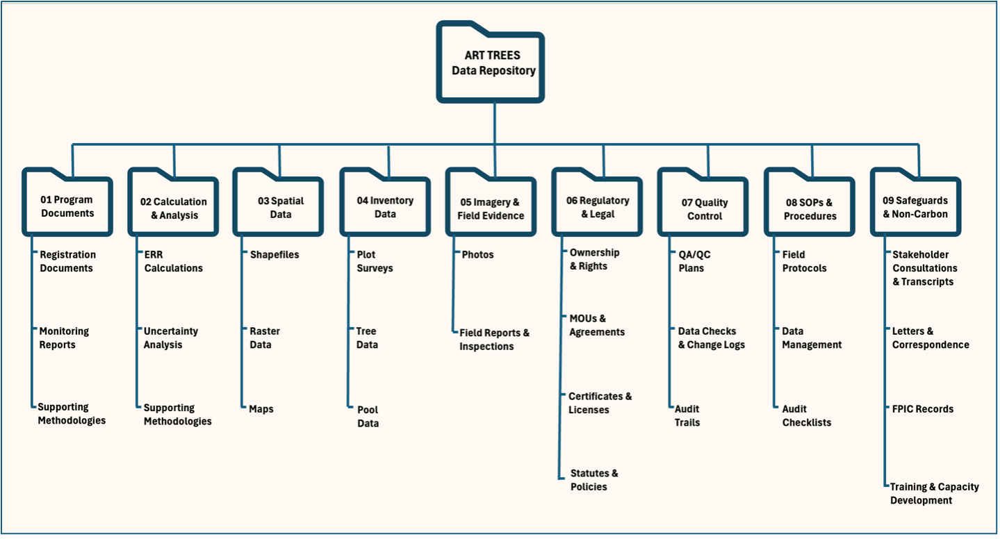

[](https://art.apx.com/mymodule/reg/TabDocuments.asp?r=111&ad=Prpt&act=update&type=PRO&aProj=pub&tablename=doc&id1=109)
[](https://orcid.org/my-orcid?orcid=0000-0002-1792-0351)
[](https://x.com/)
[](https://www.ambiente.gob.ec/)
[](https://nextcloud.ambiente.gob.ec)

--------------------------------------------------------------------------------

Welcome to the
[ART-TREES-demo-repository.git](https://github.com/seamusrobertmurphy/TREES-demo-repository),
a training resource for submitting a complete data package for an ART TREES
verification audit. Here, we document some best practices for using version
control to ensure perfect reproducibility of your calculations.

As you navigate this repository, keep the following concepts of **Data
Integrity** in mind, as these are fundamental to how auditors evaluate your
submission:

-   **Data Traceability**: Every key figure must be traceable back to its
    original source data and the methodology used to derive it.
-   **Data Completeness**: All information required to justify your GHG
    assertion must be included, with nothing significant missing.
-   **Data Curation**: A logical folder structure, descriptive file names, and
    clear documentation allow auditors to quickly find what they need.

For a deeper dive into these principles, see the **Repository Guidelines**
section below.

-   [The Practical Exercise: Mock Audit](#the-practical-exercise-mock-audit)
    -   [Step 1. Clone the Repository](#step-1-clone-the-repository)
    -   [Step 2. Replicate the Script](#step-2-replicate-the-script)
    -   [Step 3. Document Runtime Log](#step-3-document-runtime-log)
-   [Appendix I: Repository Guidelines](#appendix-i-repository-guidelines)
-   [Appendix II: ISO Guidelines](#appendix-ii-iso-guidelines)
-   [Appendix III: Replication in `renv`](#appendix-iii-replication-in-renv)

--------------------------------------------------------------------------------

### The Practical Exercise: Mock Audit {#the-practical-exercise-mock-audit}

#### Step 1. Clone the Repository

Before starting, please ensure Git CLI (or Git Desktop), R, and RStudio are
installed, and an internet connection is possible (see Appendix III for
installation details).

Open your command-line tool (or GitHub Desktop) and clone this repository to
your local computer. This step is crucial for working with precise,
version-controlled data.

``` r
git clone https://github.com/seamusrobertmurphy/TREES-demo-repository.git`
```

--------------------------------------------------------------------------------

#### Step 2. Replicate the Script

The analysis script and its data are located in the /02_Carbon_Data/ directory.
Simply open the ART-TREES-TMR-Replication-Demo.Rmd file in your R environment
and run it. The script will automatically perform a simple carbon stock
calculation and output the final result.

-   Open the Script: Launch RStudio and open the
    `02_Carbon_Data/ART-TREESdemo-replication.Rmd` file.
-   Inspect the Code: Before running, review the code. You'll see that it's
    broken down into logical chunks:
    -   Loading the required R package (`library(dplyr)`).
    -   Defining the dataset directly within the script (hypothetical forest
        plot data).
    -   Performing a simple calculation to sum the total carbon stock.
    -   Outputting the final calculated value in tCO₂e.
-   Run the Script: Execute the entire R Markdown file. You can do this by
    clicking the "Run All Chunks" button in RStudio or by using the knitr
    function. The script will process the data and display the final result in
    the console.

The script’s output will display a single, final calculated value in tCO₂e.
Compare this result to the figure reported in Table 16 of the TMR. They should
match exactly.

-   If the results match: You have successfully demonstrated data
    reproducibility. The combination of the version-controlled data and script
    in this repository has produced the same result as the official submission.
    This is a critical success for any audit.
-   If the results do not match: This is a key learning opportunity. It shows
    how even small discrepancies, a different software version, a missing
    package, or an altered data file, can lead to different results. This is a
    common and serious finding in a verification audit, and it underscores the
    need for rigorous version control and a robust QA/QC process.

--------------------------------------------------------------------------------

#### Step 3. Document Runtime Log

To demonstrate **data integrity** and **reproducibility**, you must document the
exact software environment used for your calculations. An **auditor will require
this runtime log** to independently verify your results. This step involves
generating a log of your R session’s dependencies and committing it to the
repository.

-   Open your R console and run `devtools::session_info()`.

-   Copy the full output and save it as a text file named
    `runtime_log_YYYYMMDD.txt` in the `/06_QAQC/` folder

-   Use Git to commit this file to create a permanent, verifiable link between
    the code, the data, and the computational environment.

The resulting log serves as a snapshot of your computing system and all the
software dependencies at that precise moment in time,

--------------------------------------------------------------------------------

### Appendix I: Repository Guidelines {#appendix-i-repository-guidelines}

We provided a simplified layout in this github repository, as shown in the list
of its trunk folders below. However, this architecture can become highly nested
which may not suit everyone's preferences. Therefore, we welcome any feedback on
improved structure that is more appropriate to your project design, and provide
additional layout examples from today's slide for comparison.

-   `01_Program_Data/`

-   `02_Carbon_Data/`

    -   `TREES-demo-replication.Rmd`

-   `03_Spatial_Data/`

-   `04_Uncertainty/`

-   `05_Safeguards/`

-   `06_QAQC_SOPs/`

[](Fig,%201:%20Illustrative%20example%20of%20wider%20repository%20layout)

--------------------------------------------------------------------------------

##### Repository Principles

These are the fundamental concepts that auditors use to evaluate your
submission, which are embedded throughout this repository's structure.

-   Data Traceability: We demonstrate this through clear file naming
    conventions, a folder for QA/QC procedures, and a structure that links
    report claims to specific evidence files. Every key figure in a report, such
    as X hectares deforested, must be traceable back to its raw data source and
    the methodology used to derive it.
-   Data Completeness: This repository is organized to align directly with the
    ART TREES requirements. This provides a clear framework for you to check if
    you have all the necessary data for every required category, such as
    deforestation areas, emission factors, and safeguards information. The
    repository also includes a place to document any methodological changes made
    over time.
-   Data Curation: A well-organized data package allows auditors to quickly find
    what they need. Our layout, for example, separates Calculations & Analysis
    from Spatial Data and SOPs & Procedures. This logical grouping helps
    auditors instinctively navigate your submission. A top-level README and
    descriptive filenames are also key curation practices.
-   Data Replication: The use of a package management tool like `renv` (see
    Appendix II) allows for locking in all dependencies. This ensures that
    anyone can replicate your analysis in the exact same computational
    environment, which is a key part of the verification process.

##### Repository Governance

We offer a shortlist of default community health files that may be adapted to
include SOPs and documentation of workbook updates, always aiming to build trust
in the auditor:

-   CODE_OF_CONDUCT.md: A CODE_OF_CONDUCT file defines standards for how to
    engage in a community.
-   CONTRIBUTING.md: A CONTRIBUTING file communicates how people should
    contribute to your project. Discussion category forms can also be added to
    help customize priority templates issued to stakeholder or partners, or
    community members for opening new discussions in your repository..
-   FUNDING.yml: A FUNDING file displays a sponsor button in your repository to
    increase the visibility of funding options for your open source project.
-   GOVERNANCE.md: A GOVERNANCE file lets people know about how your project is
    governed. For example, it might discuss project roles and how decisions are
    made.
-   Pull request & config.yml: Issue and pull request templates help standardize
    the information you’d like contributors to include when they open issues and
    pull requests in your repository.
-   SECURITY.md: A SECURITY file gives instructions on how to report a security
    vulnerability in your project and description that hyperlinks the file. For
    more information, see [Adding a security policy to your
    repository](https://docs.github.com/en/code-security/getting-started/adding-a-security-policy-to-your-repository).
-   SUPPORT.md: A SUPPORT file lets people know about ways to get help with your
    project. For more information, see [Adding support resources to your
    project](https://docs.github.com/en/communities/setting-up-your-project-for-healthy-contributions/adding-support-resources-to-your-project).

--------------------------------------------------------------------------------

### Appendix II: ISO Guidelines {#appendix-ii-iso-guidelines}

The data management principles of traceability, integrity, and reproducibility
are key to GHG audits. These principles are supported by a range of ISO
standards. This appendix provides an overview of those ISO standards relevant to
GHG verification practices and ART-TREES data governance and quality
commitments. It also provides additional resources for debugging and validating
geospatial operations across platform using the `liblwgeom` library.

--------------------------------------------------------------------------------

-   **ISO 27001 & ISO 8000:** Two widely discussed ISO standards for data
    governance are ISO 27001 and ISO 8000. ISO 27001 is a standard for
    Information Security Management Systems (ISMS), while ISO 8000 focuses on
    data quality management. Implementing the ISO 27001 standard is a
    deliverable of information security management under the IT governance
    program and not solely a data governance deliverable. However, data
    governance maturity is crucial for complying with ISO 27001 and ensuring
    data security, confidentiality, and integrity in information management
    practices. ISO 8000 aims to ensure that data used in various contexts, such
    as business processes, analytics, and decision-making, meets certain quality
    standards. It covers all the key elements of data—Syntax, Provenance,
    Completion, Accuracy, and Certification—providing a standard to measure and
    certify data quality.

-   **ISO 38505-1:** This is a standard that provides a set of guidelines for
    the governance of data within an organization. It considers data governance
    as a subset of IT governance, which in turn is a subset of organizational
    governance, and defines clear responsibilities for the governing body and
    oversight mechanisms. At its core, it provides a model for evaluating,
    directing, and monitoring the handling and usage of data in an organization.

-   **ISO 22745**: This standard focuses on master data exchange between
    organizations. It specifies data requirements for messages containing master
    data, including syntax, semantic encoding, and portability. It is often used
    in conjunction with ISO 8000 to realize the benefits of assessing and
    improving data quality

-   **ISO 3166**:This standard defines codes for country names, which can be
    utilized for consistent external reference data in business applications to
    reduce time and effort in data integration and analytic tasks.

-   **ISO 11179**: This metadata registry (MDR) standard provides a framework
    for representing metadata for an organization to make data understandable
    and transferable. It provides guidance to software developers building
    metadata repositories.

-   **ISO 27701**: This standard serves as a data privacy extension to ISO
    27001, providing a framework for organizations to establish systems that
    facilitate compliance with data privacy regulations like GDPR.

-   **ISO 14064-1:2018:** This standard provides a framework for quantifying and
    reporting GHG emissions and removals. It is essential for ensuring that the
    GHG assertion is transparent, consistent, and credible, forming the
    foundation of the entire verification process.

-   **ISO 14064-2:2019:** This standard focuses on GHG projects, providing
    detailed requirements for monitoring, quantifying, and reporting activities
    that reduce emissions or enhance removals. It ensures that the specific
    methodologies used in the TREES Monitoring Report (TMR) are robust and
    verifiable.

-   **ISO 14064-3:2019:** This is the core standard for auditors. It outlines
    the principles and requirements for verifying a GHG assertion, including
    planning the verification, conducting the assessment, and managing the
    assurance engagement. Adherence to this standard ensures the audit is
    conducted with rigor and impartiality.

-   **ISO 14065:2020:** This standard specifies the requirements for the
    competence and impartiality of the verification/validation body (VVB). It
    ensures that the auditing organization itself operates to a high standard,
    building trust in the verification outcome.

-   **ISO 14066:2011:** This standard details the specific skills and knowledge
    required for the individuals conducting the audit. It ensures that the audit
    team has the necessary expertise in areas like GHG accounting, forestry, and
    local country context to make an informed and reliable assessment.

-   **ISO 19011:2018:** This standard provides a general framework for auditing
    management systems of any kind. While not specific to GHG, it offers best
    practices for audit planning, conduct, and reporting that are foundational
    to the work of a VVB and complement the more specific requirements of the
    ISO 14060 series.

--------------------------------------------------------------------------------

##### Geometry Testing

The `liblwgeom` library was derived according to the OpenGIS Simple Features
Access (SFA) geometry rules (ISO 19125) and was purposely built for unbiased
unit testing. This `TopGeometry` model drew on open-source or platform-neutral
architecture to allow access to base geometric objects including Points, Curves,
Surfaces, and Geometry Collections `sfc`.

-   The `liblwgeom` library uses the CUnit test framework for unit testing,
    which provides lightweight method to debug spatial operations.
-   The `make` check command runs a set of regression tests for the entire
    PostGIS system, which helps verify the integrity of the installation and its
    dependencies, such as `PROJ4`in cartographic projections and `GEOS` for
    topological tests.

--------------------------------------------------------------------------------

### Appendix III: Replication in `renv` {#appendix-iii-replication-in-renv}

`renv` profiles allow for managing different sets of package dependencies for
various project contexts, such as separate environments for development,
production, or demonstrations. To activate a specific `renv` profile, you have
two primary options:

##### Step 1. Set a project profile

To make a profile the default for future R sessions, run `renv::activate()`
function. Upon restarting R, you will find `lockfile` path assigned to new
project `renv` folder ( `renv/profiles/demo-repo/`).

--------------------------------------------------------------------------------

##### Step 2. Activate a temporary profile:

To activate a profile for the current R session without making it the default,
you can set the `RENV_PROFILE` environment variable.

--------------------------------------------------------------------------------

##### Step 3. Check package dependencies

Use the `Config/renv/profiles/<profile_name>/dependencies` and
`Config/renv/profiles/<profile_name>/remotes` fields to check required packages
and assign locations of remote repositories for those specific package builds.
These environment fields can be declared in the `DESCRIPTION` file specific to
that `renv` profile.

--------------------------------------------------------------------------------

##### Step 4. Manage package dependencies

-   To capture all packages currently installed in the runtime, while
    overlooking packages listed in existing environment variables, then run
    `renv::settings$snapshot.type("all")`.
-   Alternatively, you can exclude certain packages from the installation using
    the `renv::settings$ignored.packages("lwgeom")` function. This proves useful
    with many debugging and versioning issues among new users.
-   There is also option to manually load and test an `explicit` customized
    snapshot that overlooks default environment fields previously written into
    the runtime.

``` r
# Activate 'demo-repo' profile and set as default for the project
renv::activate(profile = "demo-repo")

# To activate a 'dev' profile for a single session only
Sys.setenv(RENV_PROFILE = "dev")

# Defining dependencies in DESCRIPTION index
Config/renv/profiles/shiny/dependencies: shiny, tidyverse
Config/renv/profiles/shiny/remotes: rstudio/shiny, tidyverse/tidyverse

# Enable 'explicit' snapshot function for the project
renv::settings$snapshot.type("explicit")

# Exclude package from current environment 
renv::settings$ignored.packages("lwgeom")

# deactivate the currently-activated project
renv::deactivate()
```

##### Runtime Log

``` r
devtools::session_info()
```

```         
─ Session info ──────────────────────────────────────────────────────────────────────────────────────────
 setting  value
 version  R version 4.4.3 (2025-02-28)
 os       Fedora Linux 40 (Workstation Edition)
 system   x86_64, linux-gnu
 ui       RStudio
 language (EN)
 collate  en_CA.UTF-8
 ctype    en_CA.UTF-8
 tz       America/Vancouver
 date     2025-08-10
 rstudio  2025.05.0+496 Mariposa Orchid (desktop)
 pandoc   3.1.3 @ /usr/bin/pandoc
 quarto   1.7.31 @ /usr/bin/quarto

─ Packages ──────────────────────────────────────────────────────────────────────────────────────────────
 package     * version date (UTC) lib source
 cachem        1.1.0   2024-05-16 [2] CRAN (R 4.4.0)
 cli           3.6.5   2025-04-23 [2] CRAN (R 4.4.3)
 CoprManager   0.5.7   2025-04-26 [4] local
 devtools      2.4.5   2022-10-11 [2] CRAN (R 4.4.0)
 digest        0.6.37  2024-08-19 [2] CRAN (R 4.4.1)
 ellipsis      0.3.2   2021-04-29 [2] CRAN (R 4.4.0)
 fastmap       1.2.0   2024-05-15 [2] CRAN (R 4.4.0)
 fs            1.6.6   2025-04-12 [2] CRAN (R 4.4.3)
 glue          1.8.0   2024-09-30 [2] CRAN (R 4.4.1)
 htmltools     0.5.8.1 2024-04-04 [2] CRAN (R 4.4.0)
 htmlwidgets   1.6.4   2023-12-06 [2] CRAN (R 4.4.0)
 httpuv        1.6.16  2025-04-16 [2] CRAN (R 4.4.3)
 later         1.4.2   2025-04-08 [2] CRAN (R 4.4.3)
 lifecycle     1.0.4   2023-11-07 [2] CRAN (R 4.4.0)
 magrittr      2.0.3   2022-03-30 [2] CRAN (R 4.4.0)
 memoise       2.0.1   2021-11-26 [2] CRAN (R 4.4.0)
 mime          0.13    2025-03-17 [2] CRAN (R 4.4.3)
 miniUI        0.1.2   2025-04-17 [2] CRAN (R 4.4.3)
 pkgbuild      1.4.7   2025-03-24 [2] CRAN (R 4.4.3)
 pkgload       1.4.0   2024-06-28 [2] CRAN (R 4.4.1)
 profvis       0.4.0   2024-09-20 [2] CRAN (R 4.4.1)
 promises      1.3.2   2024-11-28 [2] CRAN (R 4.4.2)
 purrr         1.0.4   2025-02-05 [2] CRAN (R 4.4.2)
 R6            2.6.1   2025-02-15 [2] CRAN (R 4.4.2)
 Rcpp          1.0.14  2025-01-12 [2] CRAN (R 4.4.2)
 remotes       2.5.0   2024-03-17 [2] CRAN (R 4.4.0)
 rlang         1.1.6   2025-04-11 [2] CRAN (R 4.4.3)
 rstudioapi    0.17.1  2024-10-22 [2] CRAN (R 4.4.1)
 sessioninfo   1.2.3   2025-02-05 [2] CRAN (R 4.4.2)
 shiny         1.10.0  2024-12-14 [2] CRAN (R 4.4.2)
 urlchecker    1.0.1   2021-11-30 [2] CRAN (R 4.4.0)
 usethis       3.1.0   2024-11-26 [2] CRAN (R 4.4.2)
 vctrs         0.6.5   2023-12-01 [2] CRAN (R 4.4.0)
 xtable        1.8-4   2019-04-21 [2] CRAN (R 4.4.0)

 [1] /home/seamus/R/x86_64-redhat-linux-gnu-library/4.4
 [2] /usr/local/lib/R/library
 [3] /usr/lib64/R/library
 [4] /usr/share/R/library

──────────────────────────────────────────────────────────────────────────────
```
